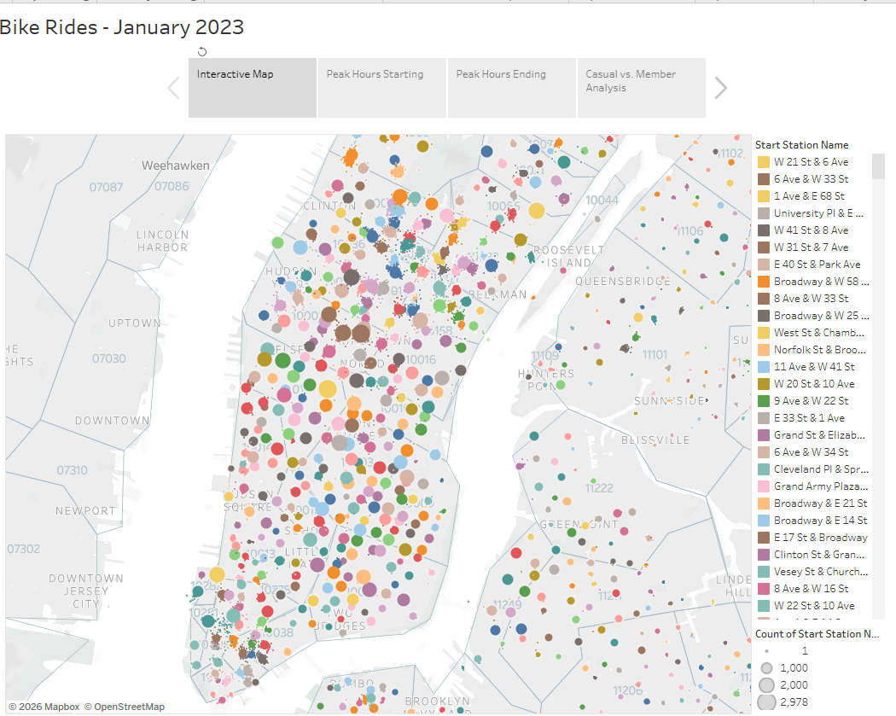

# 🚲 Bike Share Customer Analytics Dashboard

## 📌 Project Summary

This project analyzes bike-sharing trip data to identify rider behavior patterns, station demand, and membership trends that can support smarter operational decisions for urban mobility services.

The goal was to transform raw trip data into a business intelligence dashboard that enables stakeholders to quickly understand:

- When riders use the service most
- Which stations generate the highest traffic
- How customer types behave differently
- Where operational improvements can be made

The final deliverable is an interactive Tableau dashboard designed for both technical and non-technical audiences.

---

## 🎯 Business Objective

Bike-share companies need accurate data to answer critical business questions:

- Which stations need more bikes?
- Which times create demand spikes?
- Are casual riders converting into subscribers?
- Where are resources underutilized?

This analysis helps improve:

✅ Bike availability  
✅ Customer experience  
✅ Operational efficiency  
✅ Revenue strategy  

---

## 🛠 Tools & Technologies

| Tool | Purpose |
|------|---------|
| Tableau Public | Interactive dashboard development |
| Data Cleaning | Preparing ride data for analysis |
| Exploratory Analysis | Identifying usage trends |
| KPI Reporting | Measuring business performance |

---

## 📊 Dashboard Features

### Ridership Trends
Analyzes:
- Daily ride volume
- Hourly usage peaks
- Weekday vs weekend behavior

### Station Performance
Measures:
- Top starting stations
- Top ending stations
- High-demand locations

### Customer Segmentation
Compares:
- Members vs casual riders
- Ride frequency
- Trip duration patterns

### Geographic Insights
Visualizes:
- Station locations
- Traffic hotspots
- Usage concentration areas

---

## 📈 Key Insights

### 1. Subscribers Generate Most Revenue Potential
Member riders accounted for the majority of total trips, showing the importance of recurring users for long-term sustainability.

### 2. Peak Usage Matches Commute Hours
Demand increased during:
- **Morning:** 7 AM – 9 AM  
- **Evening:** 4 PM – 7 PM  

This indicates strong commuter reliance on the service.

### 3. Station Imbalance Opportunity
Several stations consistently experienced higher traffic, suggesting opportunities for improved bike redistribution.

### 4. Casual Riders Take Longer Trips
Casual users typically had longer trip durations, reflecting more leisure-based usage.

---

## 💼 Business Value Delivered

This project demonstrates how data can support strategic decisions such as:

- Optimizing station inventory
- Improving bike allocation
- Reducing customer wait times
- Supporting subscription growth initiatives
- Identifying expansion opportunities

---

## 🔗 Interactive Dashboard

[View the Live Tableau Dashboard Here](https://public.tableau.com/app/profile/adaeze.mpyisi/viz/Module18Challenge_17311139439930/BikeRides-January2023)

---

## 🖼 Dashboard Preview

Add a screenshot here for stronger recruiter impact.

markdown

